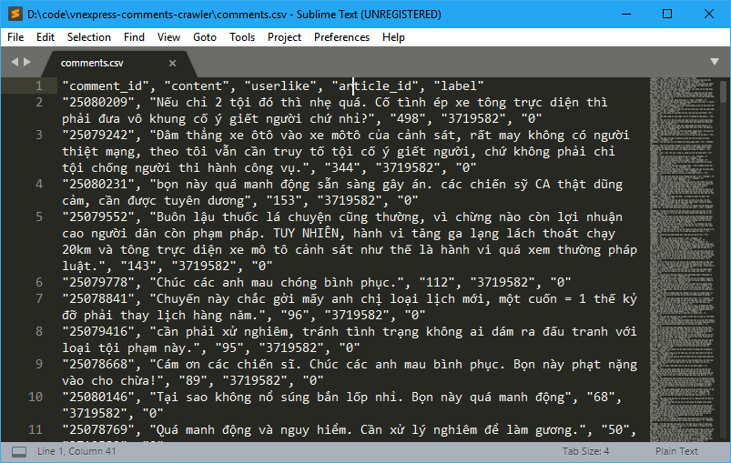

# Comment's VnExpress crawler

Crawler some small comments data of VnExpress.

See the CSV result: [comments.csv](comments.csv)

*Some magic here. Do it at your own risk :)*


# Usage

1. Update `start_url` URL in [index.js](index.js)
	```js
	var start_url = 'https://vnexpress.net/tin-tuc/phap-luat';
	```

2. Run the `index.js`
	```bash
	node index.js
	```
	This script will try to fetch all `JS Comment Content` ([example link](https://usi-saas.vnexpress.net/index/get?callback=jQuery1124035852765418408516_1520696077717&offset=0&limit=24&frommobile=0&sort=like&objectid=3719920&objecttype=1&siteid=1002565&categoryid=1002575&sign=dc72f090810fe4c7bd63be49f27be07c&cookie_aid=fkhfit47ll5mv9ee&usertype=4&template_type=1&title=Ghi+hai+b%C3%A0n+trong+ba+ph%C3%BAt%2C+Juventus+th%E1%BA%AFng+ng%C6%B0%E1%BB%A3c+Tottenham+-+VnExpress+Th%E1%BB%83+Thao&app_mobile_device=0&_=1520696077718)) to `data folder`

	

3. Run the `parse_usi-saas.js`
	```bash
	node parse_usi-saas.js
	```
	This script will parse all these content to csv (or json with your customize).

	

# Author

Van-Duyet Le @ 2018