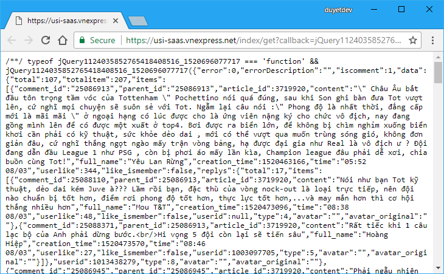

# Comment's VnExpress crawler

Crawler some small comments data of VnExpress.

See the CSV result: [comments.csv](comments.csv)

*Some magic here. Do it at your own risk :)*


# Usage

1. Update `start_url` URL in [index.js](index.js)
	```js
	var start_url = 'https://vnexpress.net/tin-tuc/phap-luat';
	```

2. Run the `index.js`
	```bash
	node index.js
	```
	This script will try to fetch all `JS Comment Content` ([example link](https://usi-saas.vnexpress.net/index/get?callback=jQuery1124035852765418408516_1520696077717&offset=0&limit=24&frommobile=0&sort=like&objectid=3719920&objecttype=1&siteid=1002565&categoryid=1002575&sign=dc72f090810fe4c7bd63be49f27be07c&cookie_aid=fkhfit47ll5mv9ee&usertype=4&template_type=1&title=Ghi+hai+b%C3%A0n+trong+ba+ph%C3%BAt%2C+Juventus+th%E1%BA%AFng+ng%C6%B0%E1%BB%A3c+Tottenham+-+VnExpress+Th%E1%BB%83+Thao&app_mobile_device=0&_=1520696077718)) to `data folder`

	

3. Run the `parse_usi-saas.js`
	```bash
	node parse_usi-saas.js
	```
	This script will parse all these content to csv (or json with your customize).

	

# How to contribute
1. Fork the project on Github
2. Create a topic branch for your changes
3. Ensure that you provide documentation and test coverage for your changes (patches won’t be accepted without)
4. Create a pull request on Github (these are also a great place to start a conversation around a patch as early as possible)

# License

MIT License

Copyright (c) 2018 Van-Duyet Le

Permission is hereby granted, free of charge, to any person obtaining a copy of this software and associated documentation files (the "Software"), to deal in the Software without restriction, including without limitation the rights to use, copy, modify, merge, publish, distribute, sublicense, and/or sell copies of the Software, and to permit persons to whom the Software is furnished to do so, subject to the following conditions:

The above copyright notice and this permission notice shall be included in all copies or substantial portions of the Software.

THE SOFTWARE IS PROVIDED "AS IS", WITHOUT WARRANTY OF ANY KIND, EXPRESS OR IMPLIED, INCLUDING BUT NOT LIMITED TO THE WARRANTIES OF MERCHANTABILITY, FITNESS FOR A PARTICULAR PURPOSE AND NONINFRINGEMENT. IN NO EVENT SHALL THE AUTHORS OR COPYRIGHT HOLDERS BE LIABLE FOR ANY CLAIM, DAMAGES OR OTHER LIABILITY, WHETHER IN AN ACTION OF CONTRACT, TORT OR OTHERWISE, ARISING FROM, OUT OF OR IN CONNECTION WITH THE SOFTWARE OR THE USE OR OTHER DEALINGS IN THE SOFTWARE.